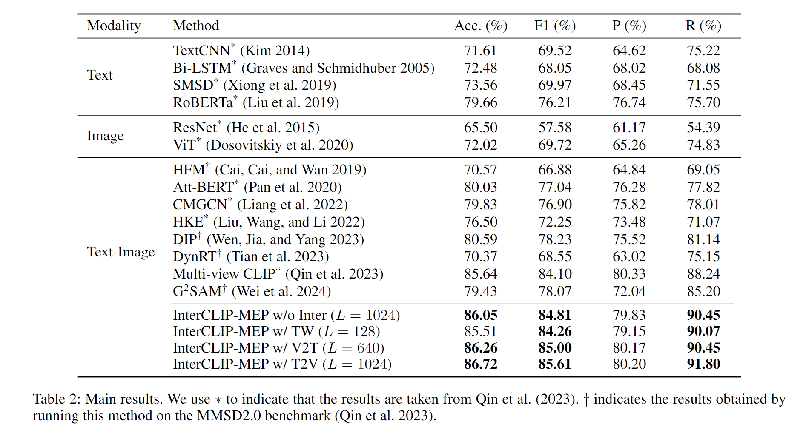
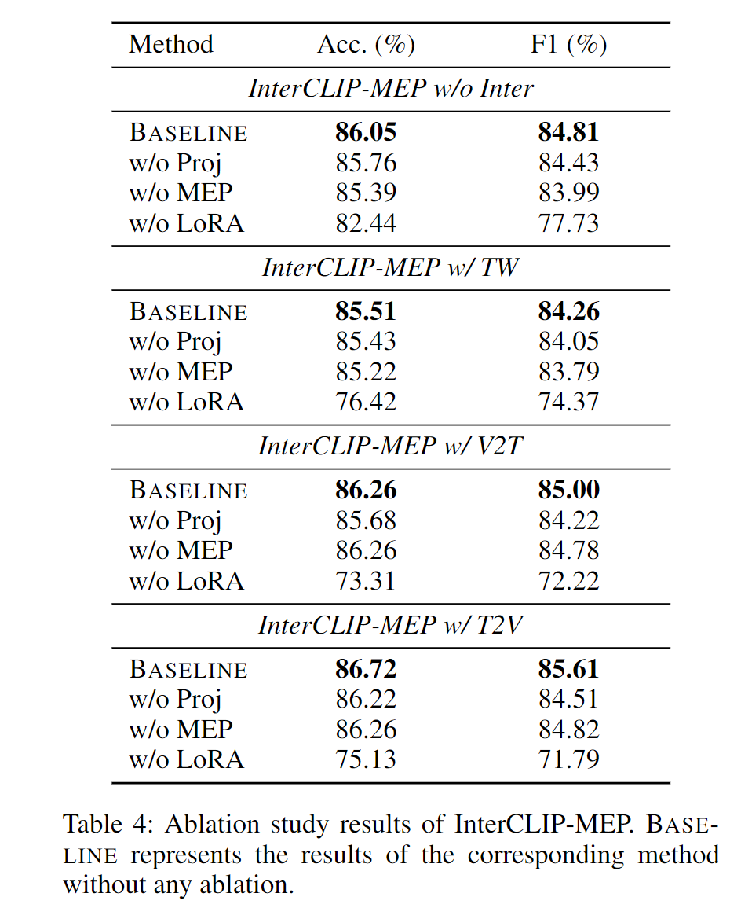
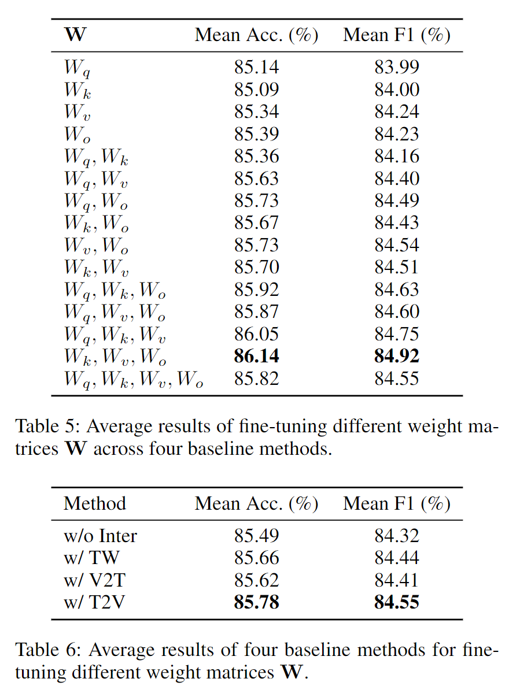
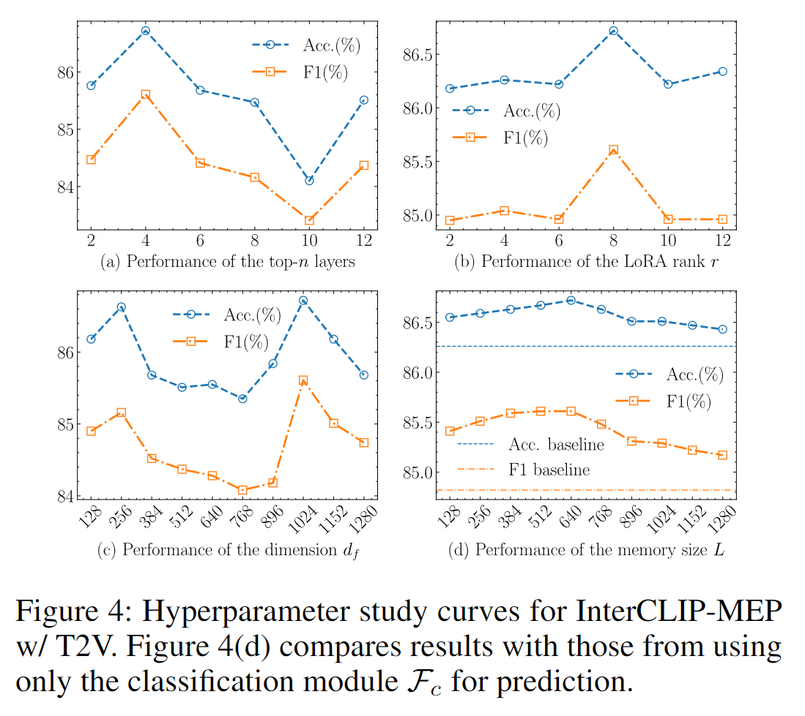

# 😼InterCLIP-MEP: Interactive CLIP and Memory-Enhanced Predictor for Multi-modal Sarcasm Detection [](https://arxiv.org/abs/2406.16464)

## 📄Abstract

Sarcasm in social media, often expressed through text-image combinations, poses challenges for sentiment analysis and intention mining.
Current multi-modal sarcasm detection methods have been shown to overestimate performance due to reliance on spurious cues, which fail to effectively capture the intricate interactions between text and images.
To solve this problem, we propose InterCLIP-MEP, a novel framework for multi-modal sarcasm detection, which introduces Interactive CLIP (InterCLIP) to extract enriched text-image representations by embedding cross-modal information directly into each encoder.
Additionally, we design a Memory-Enhanced Predictor (MEP) with a dynamic dual-channel memory that stores valuable test sample knowledge during inference, acting as a non-parametric classifier for robust sarcasm recognition.
Experiments on two benchmarks demonstrate that InterCLIP-MEP achieves state-of-the-art performance, with significant accuracy and F1 score improvements on MMSD and MMSD2.0.

<center>

</center>

## ℹ️Installation

### Virtual Environment

We use [`pyenv`](https://github.com/pyenv) to manage the Python environment.

If you haven't installed `Python 3.9`, please run the following command:

```bash
pyenv install 3.9
```

> Note: pyenv will try its best to download and compile the wanted Python version, but sometimes compilation fails because of unmet system dependencies, or compilation succeeds but the new Python version exhibits weird failures at runtime. (ref: https://github.com/pyenv/pyenv/wiki#suggested-build-environment)

Then, create a virtual environment with the following command:

```bash
pyenv virtualenv 3.9.19 mmsd-3.9.19
```

Finally, activate the virtual environment:

```bash
pyenv activate mmsd-3.9.19
```

You can also create the virtual environment in any way you prefer.

### Dependencies

We use [`poetry`](https://python-poetry.org/) to manage the dependencies. Please install it first.

Then, install the dependencies with the following command:

```bash
poetry install
```

## ⚠️Dataset preprocessing

We use [datasets](https://huggingface.co/docs/datasets/en/index) library to read the dataset.

Therefore, we provide a script [convert_mmsd2_to_imagefolder_data.py](./scripts/convert_mmsd2_to_imagefolder_data.py) to convert MMSD2.0 into a format readable by the Hugging Face datasets library and upload it to Hugging Face.
Please follow the instructions in [MMSD2.0](https://github.com/JoeYing1019/MMSD2.0?tab=readme-ov-file) to prepare the data.

Then, modify line 12 in [convert_mmsd2_to_imagefolder_data.py](./scripts/convert_mmsd2_to_imagefolder_data.py) to specify the dataset path. Next, change lines 109-110 to the name of the dataset you wish to upload to Hugging Face (before doing this, you must first login using `huggingface-cli`, for details see: https://huggingface.co/docs/datasets/en/upload_dataset#upload-with-python).
Afterwards, run the script `python scripts/convert_mmsd2_to_imagefolder_data.py`.

To use the OpenCLIP checkpoint, you need to directly run `scripts/openclip2interclip.py`.

Finally, you need to specify the name of the dataset you uploaded and some necessary paths in all config files.

## ⚗️Reproduce Results

[](https://huggingface.co/datasets/coderchen01/MMSD2.0/)

```shell
# Main results
./scripts/run_main_results-clip-base-MMSD.sh
./scripts/run_main_results-clip-base-MMSD2.0.sh
./scripts/run_main_results-clip-roberta-MMSD.sh
./scripts/run_main_results-clip-roberta-MMSD2.0.sh
```

<details>
<summary>Click to see the results</summary>
<center>

</center>
</details>

```shell
# Ablation study
./scripts/run_ablation_study.sh
```

<details>
<summary>Click to see the results</summary>
<center>

</center>
</details>

```shell
# LoRA analysis
./scripts/run_lora_analysis.sh
```

<details>
<summary>Click to see the results</summary>
<center>

</center>
</details>

```shell
# Hyperparameter study for InterCLIP-MEP w/ T2V
./scripts/run_hyperparam_study.sh
```

<details>
<summary>Click to see the results</summary>
<center>

</center>
</details>

## 🤗Acknowledgement

- [Hugging Face](https://huggingface.co/)
- [CLIP](https://github.com/openai/CLIP)
- [OpenCLIP](https://github.com/mlfoundations/open_clip)
- [MMSD2.0 benchmark](https://github.com/JoeYing1019/MMSD2.0?tab=readme-ov-file)
- [MMSD benchmark](https://github.com/wrk226/pytorch-multimodal_sarcasm_detection)

## 📃Reference

If you find this project useful for your research, please consider citing the following paper:

```bibtex
@misc{chen2024interclipmep,
      title={InterCLIP-MEP: Interactive CLIP and Memory-Enhanced Predictor for Multi-modal Sarcasm Detection}, 
      author={Junjie Chen and Hang Yu and Weidong Liu and Subin Huang and Sanmin Liu and Linfeng Zhang},
      year={2024},
      eprint={2406.16464},
      archivePrefix={arXiv},
      primaryClass={cs.CL},
      url={https://arxiv.org/abs/2406.16464}, 
}
```

## 📝License

See the [LICENSE](./LICENSE.md) file for license rights and limitations (MIT).

## 📧Contact

If you have any questions about our work, please do not hesitate to contact [Junjie Chen](mailto:jorji.chen@gmail.com).
