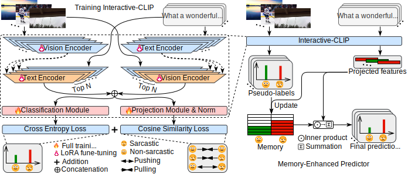

# InterCLIP-MEP: Interactive CLIP with Memory-Enhanced Predictor for Multi-modal Sarcasm Detection

## Abstract
With the rise of social media, people often use sarcasm, expressed through text and images, to convey emotions.
Automatically detecting sarcasm from multi-modal data (such as text and images) benefits tasks like sentiment analysis and intention mining.
The task of multi-modal sarcasm detection has garnered widespread attention.
However, existing works have been validated on a benchmark (MMSD) that contains spurious cues.
This results in models learning biases from these spurious cues, failing to truly capture interactive information from different modalities to detect sarcasm.
This motivated us to introduce a novel and robust multi-modal sarcasm detection framework (InterCLIP-MEP).
InterCLIP-MEP mainly consists of two modules: Interactive-CLIP and the Memory-Enhanced Predictor (MEP).
Interactive-CLIP is used as the backbone for extracting sample representations.
Building on the general CLIP model, it conditions the text and visual encoders by embedding representations from the other modality into the encoder, thereby more effectively capturing interactions between different modalities, which is crucial for multi-modal sarcasm detection.
The core of multi-modal sarcasm detection is discovering the inconsistencies between images and text.
During inference, InterCLIP-MEP does not simply use a classification module to detect sarcasm from sample representations; instead, it uses a dynamic memory maintained by the MEP.
This memory stores the most valuable historical knowledge of test samples.
Using this memory as a non-parametric classifier is more robust than directly using a classification module for sarcasm detection.
Additional experiments validated the effectiveness of InterCLIP-MEP, achieving state-of-the-art performance on the more reliable MMSD2.0 benchmark.

<center>

</center>

## Running the code

```shell
mmsd fit -c configs/best.yaml --run-test --search-memo-size
```

## Installation

### Virtual Environment

We use [`pyenv`](https://github.com/pyenv) to manage the Python environment.

If you haven't installed `Python 3.9`, please run the following command:

```bash
pyenv install 3.9
```

> Note: pyenv will try its best to download and compile the wanted Python version, but sometimes compilation fails because of unmet system dependencies, or compilation succeeds but the new Python version exhibits weird failures at runtime. (ref: https://github.com/pyenv/pyenv/wiki#suggested-build-environment)

Then, create a virtual environment with the following command:

```bash
pyenv virtualenv 3.9 mmsd
```

Finally, activate the virtual environment:

```bash
pyenv activate mmsd
```

### Dependencies

We use [`poetry`](https://python-poetry.org/) to manage the dependencies. Please install it first.

Then, install the dependencies with the following command:

```bash
poetry install
```
