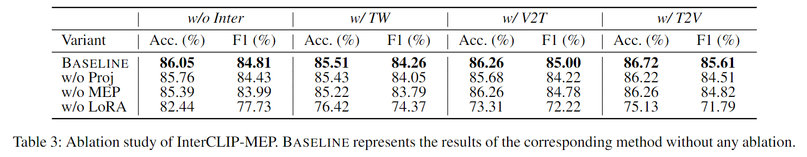

# 😼InterCLIP-MEP: Interactive CLIP and Memory-Enhanced Predictor for Multi-modal Sarcasm Detection [](https://arxiv.org/abs/2406.16464)

## 📄Abstract

The prevalence of sarcasm in social media, conveyed through text-image combinations, presents significant challenges for sentiment analysis and intention mining.
Current multi-modal sarcasm detection methods have been proven to struggle with biases from spurious cues, leading to a superficial understanding of the complex interactions between text and image.
To address these issues, we propose InterCLIP-MEP, a robust framework for multi-modal sarcasm detection.
InterCLIP-MEP introduces a refined variant of CLIP, Interactive CLIP (InterCLIP), as the backbone, enhancing sample representations by embedding cross-modality information in each encoder.
Furthermore, a novel training strategy is designed to adapt InterCLIP for a Memory-Enhanced Predictor (MEP).
MEP uses dynamic dual-channel memory to store valuable historical knowledge of test samples and then leverages this memory as a non-parametric classifier to derive the final prediction.
By using InterCLIP to encode text-image interactions more effectively and incorporating MEP, InterCLIP-MEP offers a more robust recognition of multi-modal sarcasm.
Experiments demonstrate that InterCLIP-MEP achieves state-of-the-art performance on the MMSD2.0 benchmark.

<center>

</center>

## ℹ️Installation

### Virtual Environment

We use [`pyenv`](https://github.com/pyenv) to manage the Python environment.

If you haven't installed `Python 3.9`, please run the following command:

```bash
pyenv install 3.9
```

> Note: pyenv will try its best to download and compile the wanted Python version, but sometimes compilation fails because of unmet system dependencies, or compilation succeeds but the new Python version exhibits weird failures at runtime. (ref: https://github.com/pyenv/pyenv/wiki#suggested-build-environment)

Then, create a virtual environment with the following command:

```bash
pyenv virtualenv 3.9.19 mmsd-3.9.19
```

Finally, activate the virtual environment:

```bash
pyenv activate mmsd-3.9.19
```

You can also create the virtual environment in any way you prefer.

### Dependencies

We use [`poetry`](https://python-poetry.org/) to manage the dependencies. Please install it first.

Then, install the dependencies with the following command:

```bash
poetry install
```

## ⚗️Reproduce Results

[](https://huggingface.co/datasets/coderchen01/MMSD2.0/)

```shell
# Main results
./scripts/run_main_results.sh
```

<details>
<summary>Click to see the results</summary>
<center>

</center>
</details>

```shell
# Ablation study
./scripts/run_ablation_study.sh
```

<details>
<summary>Click to see the results</summary>
<center>

</center>
</details>

```shell
# LoRA analysis
./scripts/run_lora_analysis.sh
```

<details>
<summary>Click to see the results</summary>
<center>

</center>
</details>

```shell
# Hyperparameter study for InterCLIP-MEP w/ T2V
./scripts/run_hyperparam_study.sh
```

<details>
<summary>Click to see the results</summary>
<center>

</center>
</details>

## 🤗Acknowledgement

- [Hugging Face](https://huggingface.co/)
- [CLIP](https://github.com/openai/CLIP)
- [MMSD2.0 benchmark](https://github.com/JoeYing1019/MMSD2.0?tab=readme-ov-file)

## 📃Reference

If you find this project useful for your research, please consider citing the following paper:

```bibtex
@article{chen2024interclipmep,
  title   = {InterCLIP-MEP: Interactive CLIP and Memory-Enhanced Predictor for Multi-modal Sarcasm Detection},
  author  = {Junjie Chen and Subin Huang},
  year    = {2024},
  journal = {arXiv preprint arXiv: 2406.16464}
}
```

## 📝License

See the [LICENSE](./LICENSE.md) file for license rights and limitations (MIT).

## 📧Contact

If you have any questions about our work, please do not hesitate to contact [Junjie Chen](mailto:jorji.chen@gmail.com).
